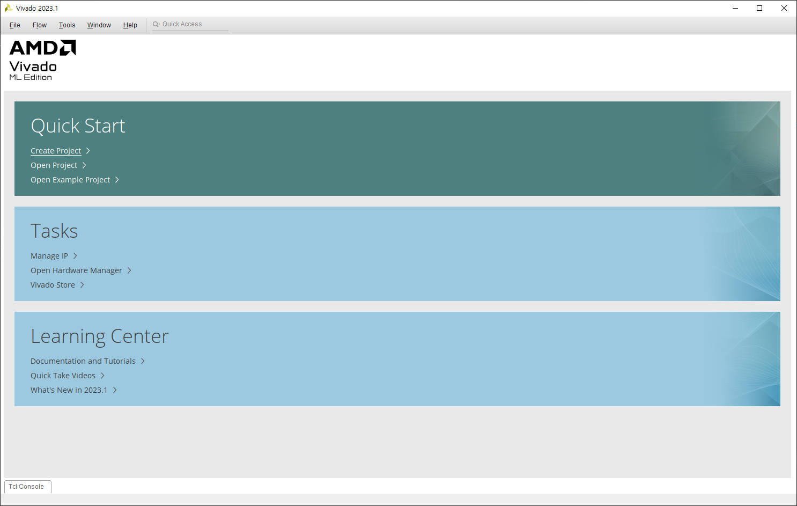
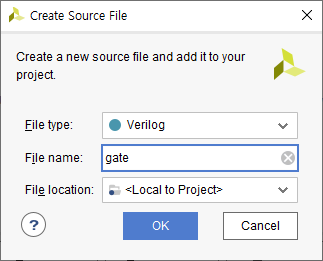

<head>
    <style>
        hr {
            color: #eee;
        }
    </style>
</haed>

# Vivado 사용법

```
간단한 And Gate 예제도 포함하고 있습니다.
```
## 프로젝트 생성

`Create Project`를 클릭합니다.



프로젝트명과 경로를 설정한 후 `Next`를 클릭합니다.


RTL Project 선택 후 `Next`


아래 화면에서 `Create File` 클릭


파일명 설정 후 `OK`. 파일 확장자는 `.v`로 자동 설정됩니다.



파일이 생성된 것을 확인했으면 `Next`


`Next` 클릭


Part는 <span style="font-weight:bold;color:#DF3A01">xc7a75tfgg484-1</span> 선택 후 `Next` 클릭합니다.


`Finish`


그 후 이런 창이 뜨는데, `OK`, `Cancle` 아무거나 눌러도 상관업습니다.


완료 후에 `gate.v`파일을 열고 (왼쪽의 <b>Sources</b>창에서 더블클릭하면 오른쪽에 열립니다)
```verilog
module and_gate(a,b,y);
    input a, b;
    output y;
    
    assign y = a & b;
endmodule
```
코드 입력 후 저장합니다.


---

## 시뮬레이션

시뮬레이션(테스트 벤치)용 소스코드를 만듭니다.


`gate_tb.v`파일을 열고
```verilog
`timescale 1ns / 1ps

module and_tb();
    reg a, b;
    wire y;
    
    and_gate uut( //uut로 and_gate 인스턴스화
        .a(a), .b(b),
        .y(y));
    
    initial begin
        a = 0; b = 0; // a와 b를 초기화
        #1000 $stop; end //1000시간동안 실행 후 멈추고 시뮬레이션 중지
    always #50 a = ~a; //50시간마다 a를 반전
    always #100 b = ~b;//100시간마다 b를 반전
endmodule
```
코드 입력 후 저장합니다.


좌측의 <b>Run Simulation</b> - <b>Run Behavioral Simulation</b> 클릭


우측 상단에 `Untitled 1`을 클릭하면 그래프를 볼 수 있고


<span>메뉴바에서 를 클릭하면</span> 아래 그래프를 확인할 수 있습니다.


---

## Contraints 설정

Xilinx Design Constraints (XDC) 파일은 Xilinx FPGA 디자인에서 사용되는 타이밍, 위치, 라우팅 등의 제약 조건을 정의하기 위한 파일입니다. 더 많은 정보는 [Using Constraints](https://docs.xilinx.com/r/en-US/ug903-vivado-using-constraints)에서 확인할 수 있습니다.

먼저 XDC 파일을 생성해 줍니다.


`gate.xdc`에

```tcl
set_property BITSTREAM.GENERAL.COMPRESS TRUE [current_design]
set_property BITSTREAM.CONFIG.CONFIGRATE 33 [current_design]
set_property CONFIG_MODE SPIx4 [current_design]
set_property -dict {PACKAGE_PIN J4 IOSTANDARD LVCMOS33} [get_ports a]
set_property -dict {PACKAGE_PIN L3 IOSTANDARD LVCMOS33} [get_ports b]
set_property -dict {PACKAGE_PIN AB18 IOSTANDARD LVCMOS33} [get_ports y]
```
코드를 입력한 후 저장해줍니다.


---

## Device에 업로드

<b>Generate Bitstream</b> 클릭, `OK` 클릭


<span>좌측 <b>Hardware</b>창에서  클릭</span>


Device가 인식되면 아래와 같이 나타납니다.


<b>Program Device</b> 선택 후


`Program`을 클릭하면 업로드가 완료됩니다.


