# Vivado 설치 가이드

```
Vivado 설치를 위해서는 용량이 최소 80 GB 정도가 요구됩니다.
본인 노트북의 용량을 확보한 후 설치를 진행해 주시기 바랍니다.
```
[Vivado 다운로드 사이트](https://www.xilinx.com/support/download.html)에 접속해

[AMD Unified Installer for FPGAs & Adaptive SoCs 2023.1: Windows Self Extracting Web Installer](https://www.xilinx.com/member/forms/download/xef.html?filename=Xilinx_Unified_2023.1_0507_1903_Win64.exe) 링크를 클릭합니다.

* 최신 버전인 2023.1 버전을 설치해 주시기 바랍니다.

AMD 로그인 창이 뜨면, 회원가입 합니다.

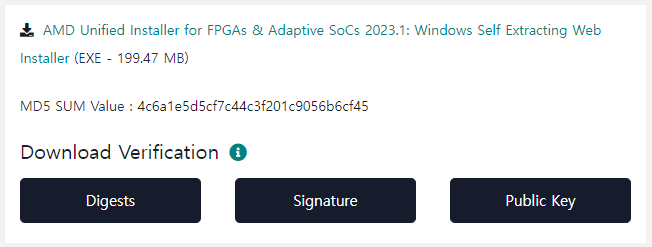

로그인 후 아래 페이지에서 설치파일을 다운로드합니다.

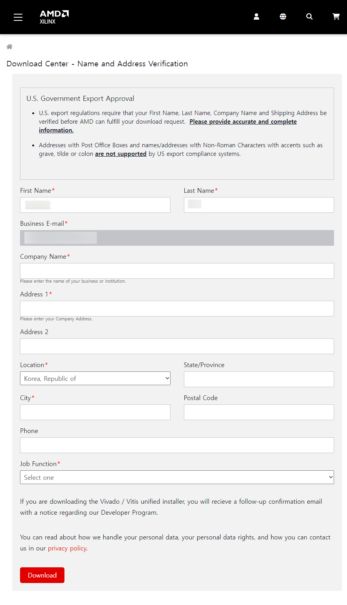

본인의 AMD 계정을 입력한 후 `Next`를 클릭합니다.

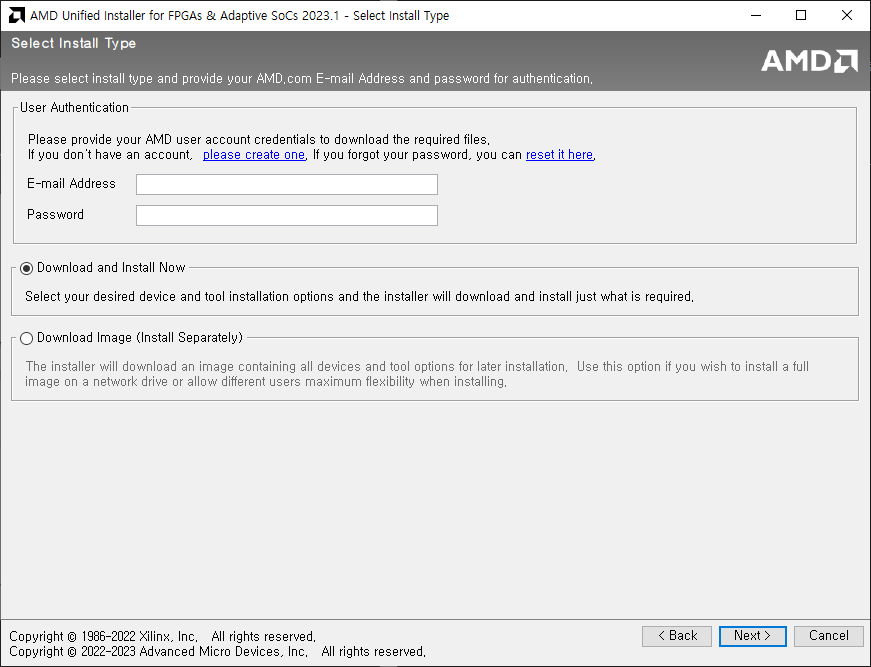

Vivado 선택

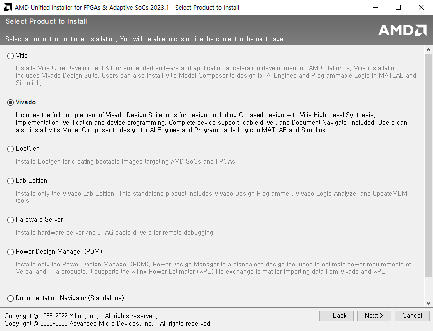

Standard 버전 선택

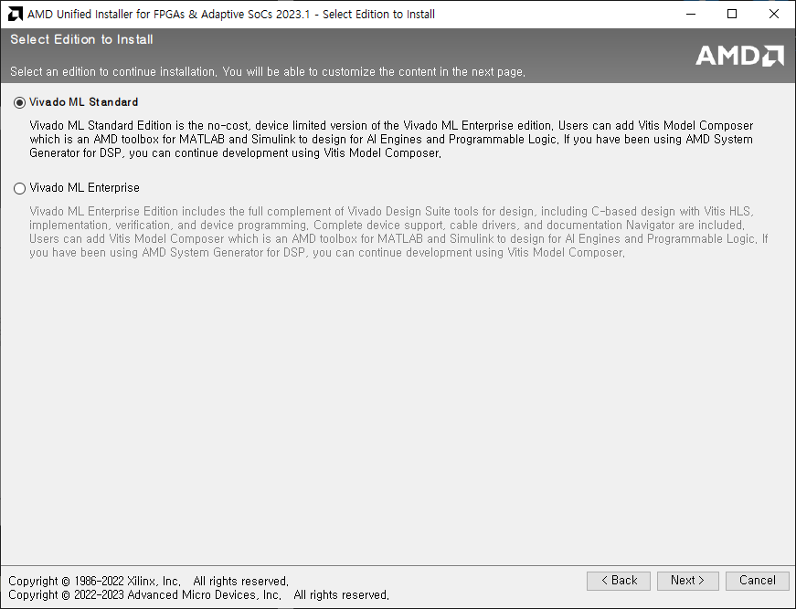

전체 선택 후 `Next`

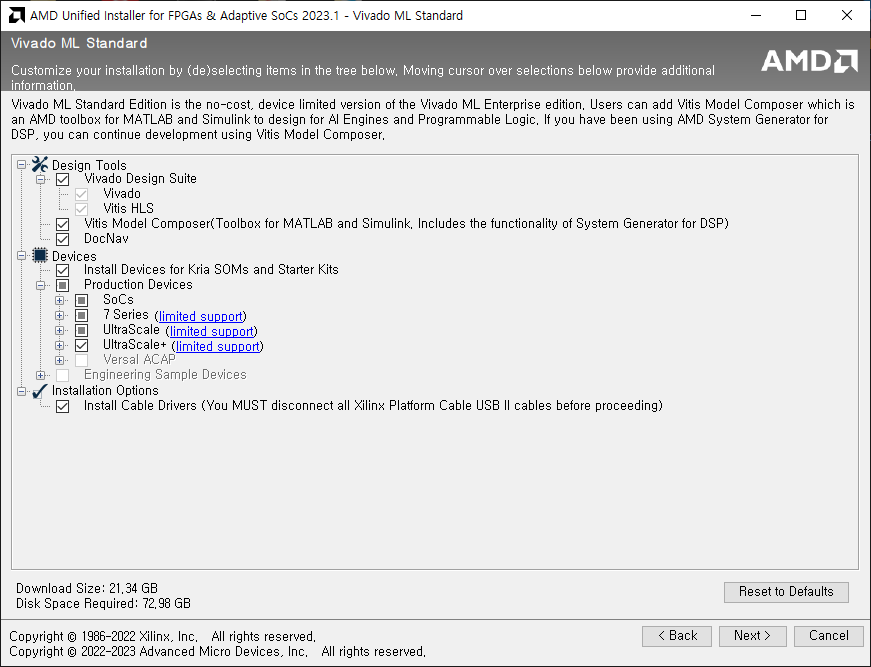

라이센스 동의 체크합니다.

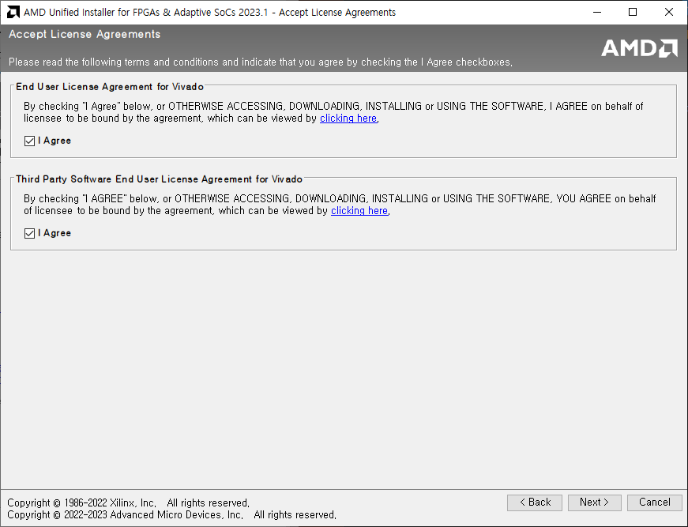

설치 경로와 용량을 확인합니다. 용량이 부족하면 `Next` 버튼이 눌려지지 않습니다.

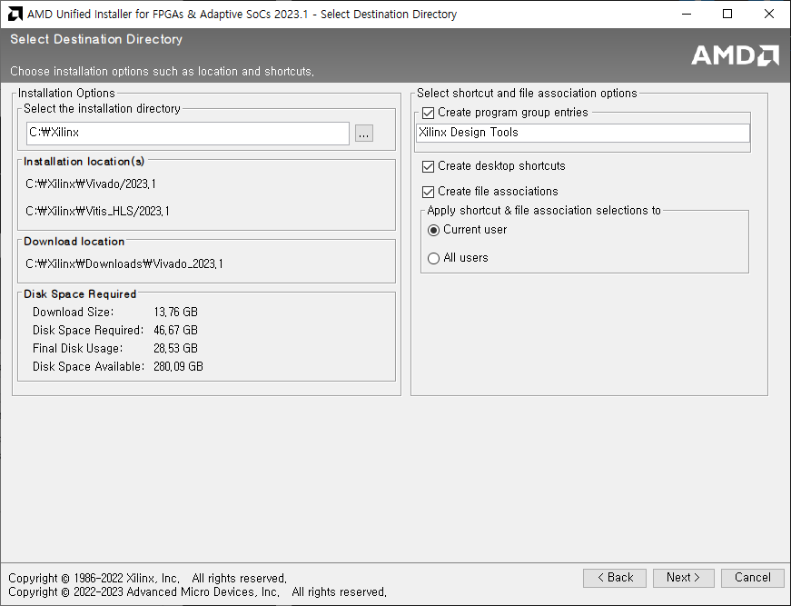

이어서 설치를 진행합니다.

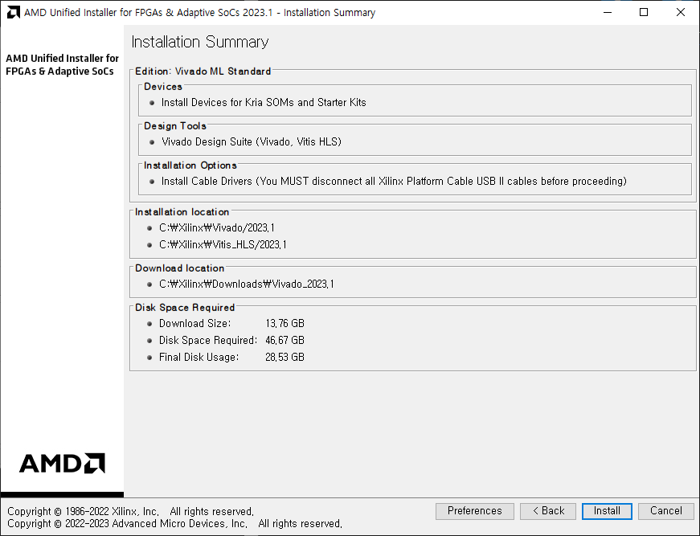
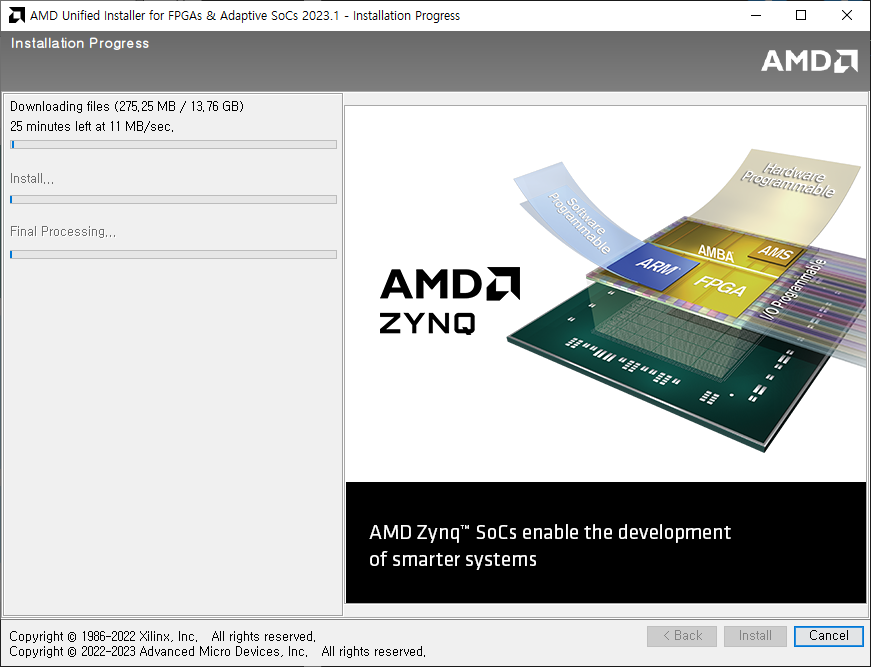

설치 완료 후 Vivado를 실행하면 아래와 같이 실행됩니다.

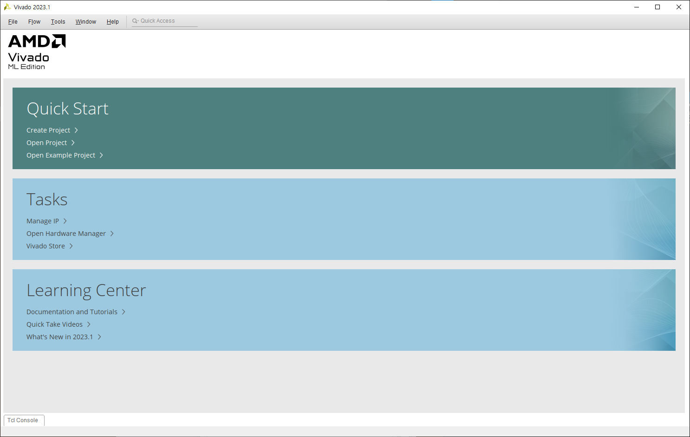
